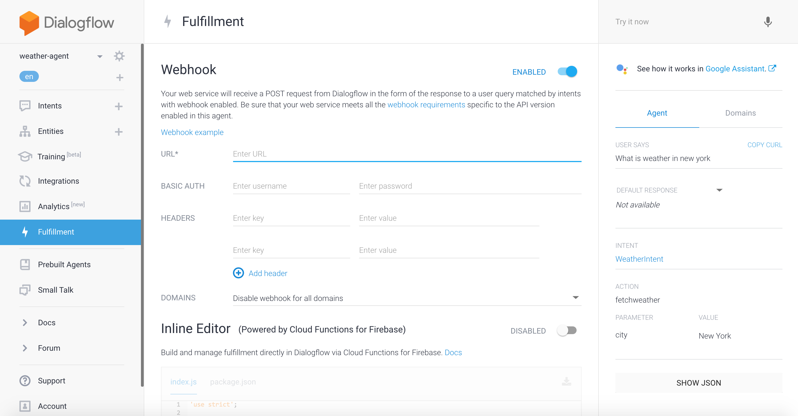

# weather-dialogflow

This is an action that tells current weather of the city by using the Dialogflow.

# Getting Started

## Create the developer project and Dialogflow agent

1. Go to the [Actions on Google Developer Console](https://console.actions.google.com/).
1. Click on Add Project, enter YourAppName for the project name, and click Create Project.
1. In the Overview screen, click BUILD on the Dialogflow card and then CREATE ACTIONS ON Dialogflow to start building actions.
1. The Dialogflow console appears with information automatically populated in an agent. Click Create to save the agent.

## Create an Intent

For your first app, we recommend you start with the Dialogflow starter app. It includes a Dialogflow agent with intents that you'll most likely use and a Google Cloud Function for fullfillment.

1. Restore the ```weather-dialogflow/weather-agent.zip``` into the YourAppName agent:
1. In the left navigation, click on the gear icon to the right of the agent name.
1. Click on the Export and Import tab.
1. Click RESTORE FROM ZIP and select the ```weather-dialogflow/weather-agent.zip``` file.
1. Type RESTORE in the text box, click RESTORE, then DONE. When the restoration is finished, the following screen appears. Make note of your app's project ID; you'll need it to deploy the sample's fulfillment.

## Deploy the fulfillment

Download and install [Node.js](https://nodejs.org/en/).

Set up and initialize the Firebase CLI. If the following command fails with an EACCES error, you may need to [change npm permissions](https://docs.npmjs.com/getting-started/fixing-npm-permissions).

``` bash
$ npm install -g firebase-tools
```

Authenticate the firebase tool with your Google account:

``` bash
$ firebase login
```

Associate the firebase tool with your Actions project:

``` bash
$ firebase use <GOOGLE_PROJECT_ID>
```

Initialize a Firebase project in this directory.

```
NOTE: Please don't overwrite ```functions/package.json``` and ```functions/index.js```.
```

``` bash
$ firebase init

     🔥🔥🔥🔥🔥🔥🔥🔥 🔥🔥🔥🔥 🔥🔥🔥🔥🔥🔥🔥🔥  🔥🔥🔥🔥🔥🔥🔥🔥 🔥🔥🔥🔥🔥🔥🔥🔥     🔥🔥🔥     🔥🔥🔥🔥🔥🔥  🔥🔥🔥🔥🔥🔥🔥🔥
     🔥🔥        🔥🔥  🔥🔥     🔥🔥 🔥🔥       🔥🔥     🔥🔥  🔥🔥   🔥🔥  🔥🔥       🔥🔥
     🔥🔥🔥🔥🔥🔥    🔥🔥  🔥🔥🔥🔥🔥🔥🔥🔥  🔥🔥🔥🔥🔥🔥   🔥🔥🔥🔥🔥🔥🔥🔥  🔥🔥🔥🔥🔥🔥🔥🔥🔥  🔥🔥🔥🔥🔥🔥  🔥🔥🔥🔥🔥🔥
     🔥🔥        🔥🔥  🔥🔥    🔥🔥  🔥🔥       🔥🔥     🔥🔥 🔥🔥     🔥🔥       🔥🔥 🔥🔥
     🔥🔥       🔥🔥🔥🔥 🔥🔥     🔥🔥 🔥🔥🔥🔥🔥🔥🔥🔥 🔥🔥🔥🔥🔥🔥🔥🔥  🔥🔥     🔥🔥  🔥🔥🔥🔥🔥🔥  🔥🔥🔥🔥🔥🔥🔥🔥

You're about to initialize a Firebase project in this directory:

  /Users/lakeel/actions-on-google/weather-dialogflow

Before we get started, keep in mind:

  * You are initializing in an existing Firebase project directory

? Which Firebase CLI features do you want to setup for this folder? Press Space to select features, then Enter to confirm your choices. Functions: Configure and deplo
y Cloud Functions

=== Project Setup

First, let's associate this project directory with a Firebase project.
You can create multiple project aliases by running firebase use --add,
but for now we'll just set up a default project.

? Select a default Firebase project for this directory: actions-on-google (actions-on-caaac)

=== Functions Setup

A functions directory will be created in your project with a Node.js
package pre-configured. Functions can be deployed with firebase deploy.

? What language would you like to use to write Cloud Functions? JavaScript
? Do you want to use ESLint to catch probable bugs and enforce style? No
? File functions/package.json already exists. Overwrite? No
i  Skipping write of functions/package.json
? File functions/index.js already exists. Overwrite? No
i  Skipping write of functions/index.js
? Do you want to install dependencies with npm now? No

i  Writing configuration info to firebase.json...
i  Writing project information to .firebaserc...

✔  Firebase initialization complete!
```

Get the fulfillment dependencies and deploy the fulfillment:

``` bash
$ cd ./functions
$ npm install
$ firebase deploy --only ../functions
```

The deployment takes a few minutes. Once completed, you'll see output similar to the following. You'll need the Function URL to enter in Dialogflow.

``` bash
✔  Deploy complete!

Project Console: https://console.firebase.google.com/project/myprojectname-ab123/overview
Function URL (cloudFunctionName): https://us-central1-myprojectname-ab123.cloudfunctions.net/cloudFunctionName
```

[Deploy Fulfillment](https://developers.google.com/actions/sdk/deploy-fulfillment)

## Set up fulfillment 

Enable webhook and paste the url of the deployed cloud functions into ```URL```.



## Test your app in the Actions Simulator

1. Click on Integrations in Dialogflow's left navigation, and make sure the Google Assistant card is enabled.

2. Click on the Google Assistant card and click on TEST in the pop-up window. Dialogflow uploads the agent to our servers so you can test it out in the Actions simulator.

```
Note: If you don't see a TEST button, you need to click on the AUTHORIZE button first to give Dialogflow access to your Google account and Actions project.
```

3. In the Test your Assistant app section of the integration screen, click on the Actions Simulator link to open a new browser for the Actions simulator.

```
Note: If you're presented with the Actions simulator splash screen, click Start to authenticate with your Google account.
```

4. In the Actions Simulator, enter 'talk to my test' app in the Input area of the simulator to test the app.